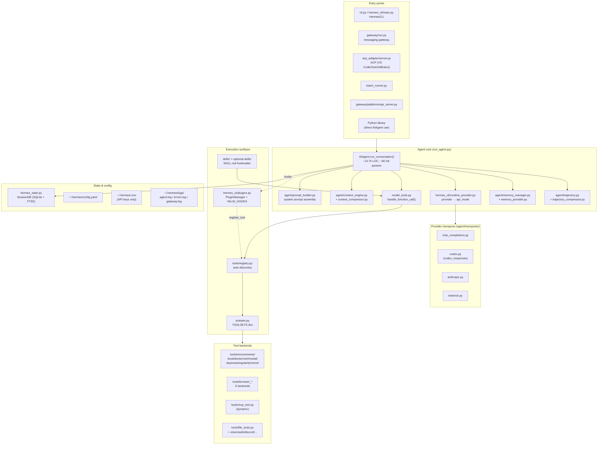
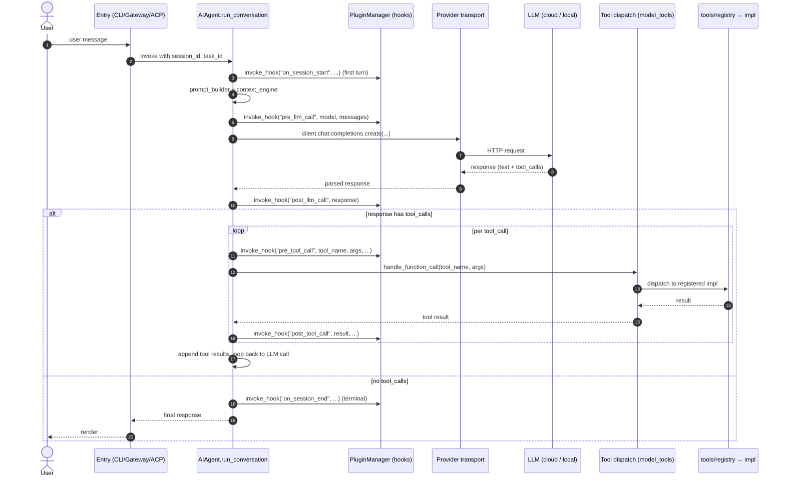
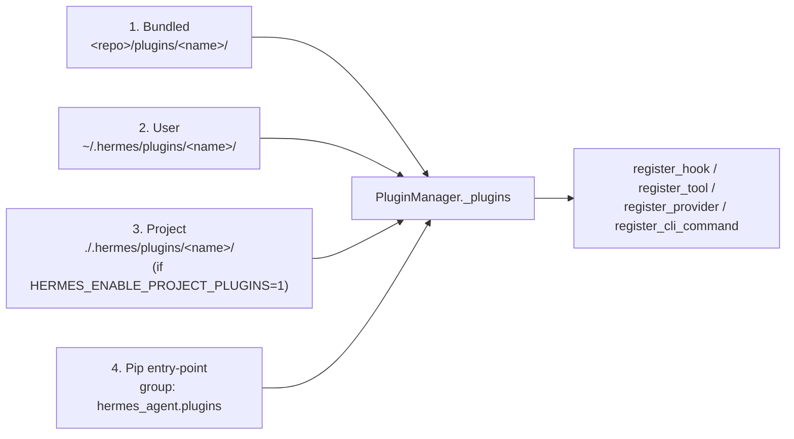
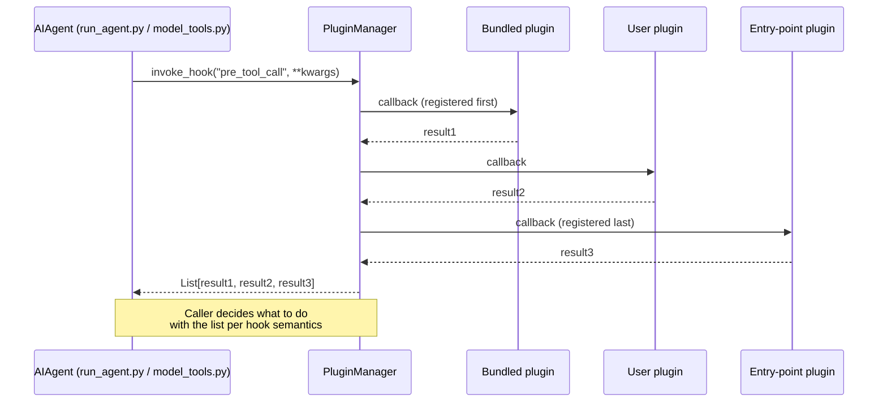
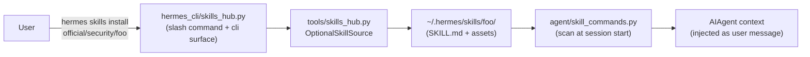
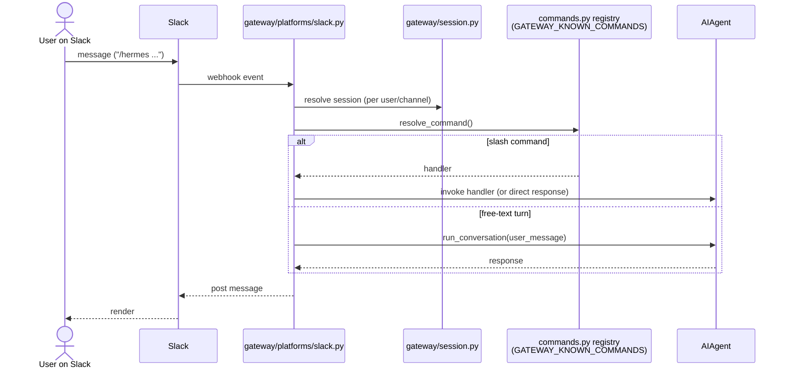

# Hermes Design Overview

> **Purpose**: One-page architectural map of upstream Hermes (`hermes-agent`).
> Provides diagrams, layered subsystem overview, and deep links into the
> canonical references — does not replace them.
>
> **Position vs other docs**:
> - [`AGENTS.md`](../../../AGENTS.md) (~44k) — contributor "how to write code" guide.
> - [`website/docs/developer-guide/architecture.md`](../../../website/docs/developer-guide/architecture.md) — public top-level architecture page.
> - [`website/docs/developer-guide/*`](../../../website/docs/developer-guide/) — subsystem deep dives (`agent-loop.md`, `prompt-assembly.md`, `gateway-internals.md`, `tools-runtime.md`, etc.).
> - **This document** — visual overview, layered model, extension-point cheatsheet, snapshot-pinned for verifiability.

## Snapshot

- **Commit**: `d4493e2c6e1eeb1b7f779ab572014ff138a1c050`
- **Describe**: `v2026.4.30-631-gd4493e2c6`
- **Generated**: 2026-05-09
- **Method**: Read-only source survey + cross-reference against `AGENTS.md` and `website/docs/developer-guide/`.
- **Caveat**: Hermes evolves rapidly. **Verify against `git log` and live source before relying on this map for code changes.** Counts (e.g. "16 hooks", "27 platform adapters") reflect this snapshot only.

---

## 1. Bird's-eye component map



### ASCII layered view (no rendering tooling required)

```text
┌────────────────────────────────────────────────────────────────┐
│  Entry layer:    CLI · Gateway · ACP · Batch · API · Library   │
├────────────────────────────────────────────────────────────────┤
│  Orchestration:  HermesCLI · GatewaySession · AIAgent          │
├────────────────────────────────────────────────────────────────┤
│  Agent core:     prompt_builder · context_engine · memory ·    │
│                  retry · trajectory · provider routing         │
├────────────────────────────────────────────────────────────────┤
│  Provider:       runtime_provider → transports/ → vendor SDK   │
│                  (anthropic / openai / bedrock / codex / ...)  │
├────────────────────────────────────────────────────────────────┤
│  Tools:          tools/registry → model_tools.dispatch →       │
│                  per-tool impl (terminal/browser/file/MCP/...) │
├────────────────────────────────────────────────────────────────┤
│  Extensions:     plugins/ (4-source loader) · skills/ ·        │
│                  optional-skills/ · 16 lifecycle hooks         │
├────────────────────────────────────────────────────────────────┤
│  Backends:       7 terminal · 5 browser · MCP · vision · ...   │
├────────────────────────────────────────────────────────────────┤
│  State:          SQLite session DB · config.yaml · .env · logs │
└────────────────────────────────────────────────────────────────┘
```

---

## 2. Request lifecycle

End-to-end flow for a single user turn that invokes one tool:



The loop is **synchronous** with terminating conditions: (a) response has no tool calls, (b) `max_iterations` exhausted, (c) `iteration_budget` depleted, (d) user-initiated interrupt. See [`AGENTS.md` § Agent Loop](../../../AGENTS.md) and [`website/docs/developer-guide/agent-loop.md`](../../../website/docs/developer-guide/agent-loop.md).

---

## 3. Subsystems

Each subsection: 1-paragraph overview, key files, primary contract, and a deep-link.

### 3.1 Agent core (`run_agent.py`)

Single class `AIAgent` (~13.7k LOC at this snapshot, ~60 `__init__` parameters) that owns the conversation loop. Public surface:

- `chat(message) -> str` — simple interface, returns final response string.
- `run_conversation(user_message, system_message=None, conversation_history=None, task_id=None) -> dict` — full interface, returns `{final_response, messages}`.

The loop is synchronous with interrupt checks, iteration budget, one-turn grace call. Messages follow OpenAI chat format; reasoning content stored in `assistant_msg["reasoning"]`. Deep dive: [`AGENTS.md` § AIAgent Class](../../../AGENTS.md), [`website/docs/developer-guide/agent-loop.md`](../../../website/docs/developer-guide/agent-loop.md).

### 3.2 CLI surface (`cli.py` + `hermes_cli/`)

`cli.py` hosts the interactive `HermesCLI` (~11.5k LOC). `hermes_cli/main.py` (~10.4k LOC) hosts the argparse tree for all `hermes <subcmd>` invocations. Notable design choices:

- **Centralized slash command registry**: all slash commands defined as `CommandDef` entries in `hermes_cli/commands.py:COMMAND_REGISTRY`. Every consumer (CLI dispatch, Gateway dispatch, `/help` rendering, Telegram BotCommand menu, Slack subcommand routing, autocomplete) derives from this single list. Adding an alias is a 1-line change.
- **Skin engine** (`hermes_cli/skin_engine.py`): data-driven theming initialized from `display.skin` config key.
- **Setup wizard** (`hermes_cli/setup.py`, ~3.5k LOC): interactive first-run.
- **Plugins can extend** the CLI via `ctx.register_cli_command(...)` — argparse tree wired in at startup.

Deep dive: [`AGENTS.md` § CLI Architecture](../../../AGENTS.md), [`website/docs/developer-guide/extending-the-cli.md`](../../../website/docs/developer-guide/extending-the-cli.md).

### 3.3 Tool system (`tools/` + `model_tools.py` + `toolsets.py`)

Three layers:

1. **Tool registry** (`tools/registry.py`): each tool file calls `registry.register(...)` at import time. Auto-discovery is triggered by importing `model_tools.py`.
2. **Dispatch** (`model_tools.py`): `discover_builtin_tools()` collects schemas; `handle_function_call(tool_name, args, task_id)` dispatches at run-time.
3. **Toolsets** (`toolsets.py`): `TOOLSETS` dict groups tools into ~30 keys (`browser`, `clarify`, `code_execution`, `cronjob`, `delegation`, `discord`, `feishu_doc`, `file`, `homeassistant`, `image_gen`, `kanban`, `memory`, `messaging`, `safe`, `search`, `skills`, `terminal`, `todo`, `tts`, `video`, `vision`, `web`, etc.). `_HERMES_CORE_TOOLS` is the default bundle most platforms inherit from. Each platform adapter selects a base toolset.

Built-in tool count varies; the architecture page reports 61 tools and 52 toolsets at one snapshot. Deep dive: [`AGENTS.md` § Adding New Tools](../../../AGENTS.md), [`website/docs/developer-guide/tools-runtime.md`](../../../website/docs/developer-guide/tools-runtime.md), [`website/docs/developer-guide/adding-tools.md`](../../../website/docs/developer-guide/adding-tools.md).

### 3.4 Plugin architecture (`hermes_cli/plugins.py` + `plugins/`)

`PluginManager` discovers from **4 sources** in order:



Each plugin exposes `register(ctx)` that may call:

- `ctx.register_hook(name, callback)` — registered against `VALID_HOOKS` set (16 hooks at this snapshot).
- `ctx.register_tool(...)` — adds tools to the dispatch registry.
- `ctx.register_provider(...)` — adds an LLM provider implementation.
- `ctx.register_cli_command(...)` — wires an argparse tree under `hermes <pluginname> <subcmd>`.

**Discovery timing pitfall**: `discover_plugins()` only runs as a side effect of importing `model_tools.py`. Code paths that read plugin state without first importing `model_tools.py` must call `discover_plugins()` explicitly (idempotent). [Source: `AGENTS.md` § Plugins.]

**Plugin policy** (Teknium, May 2026): plugins MUST NOT modify core files (`run_agent.py`, `cli.py`, `gateway/run.py`, `hermes_cli/main.py`, etc.). If a capability is missing, expand the generic plugin surface (new hook, new ctx method) — never hardcode plugin-specific logic into core. [Source: `AGENTS.md`.]

**Memory plugins** are a separate discovery system (`plugins/memory/<name>/`): each implements the `MemoryProvider` ABC (`agent/memory_provider.py`). Built-in providers at this snapshot: honcho, mem0, supermemory, byterover, hindsight, holographic, openviking, retaindb. CLI for memory plugins is gated to the **active** provider only.

Deep dive: [`AGENTS.md` § Plugins](../../../AGENTS.md), [`website/docs/developer-guide/memory-provider-plugin.md`](../../../website/docs/developer-guide/memory-provider-plugin.md), [`website/docs/developer-guide/context-engine-plugin.md`](../../../website/docs/developer-guide/context-engine-plugin.md).

### 3.5 Hook dispatch model

`VALID_HOOKS` at this snapshot (`hermes_cli/plugins.py`):

```text
pre_tool_call            post_tool_call
pre_llm_call             post_llm_call
pre_api_request          post_api_request
on_session_start         on_session_end
on_session_finalize      on_session_reset
subagent_stop            pre_gateway_dispatch
pre_approval_request     post_approval_response
transform_terminal_output
transform_tool_result
```

Invocation semantics (`PluginManager.invoke_hook` at L1085):

- Callbacks invoked in **registration order** (no priority system). Plugin load order: bundled → user → project → entry-point → so entry-point plugins run last on every hook.
- Return-value semantics differ per hook (block, transform, observe). E.g. `pre_tool_call` returns may carry a block message; `transform_*` returns must be the transformed value; `pre_api_request` is observer-only.
- Hooks fire from `model_tools.py` (tool-related) and `run_agent.py` (lifecycle / LLM-related).



### 3.6 Skills system (`skills/` + `optional-skills/` + `hermes_cli/skills_hub.py`)

Two parallel surfaces:

- **`skills/`** — built-in skills shipped and loadable by default, organized by category (`skills/github/`, `skills/mlops/`, ...).
- **`optional-skills/`** — heavier or niche skills shipped but not active by default. Installed explicitly via `hermes skills install official/<category>/<skill>`. Adapter lives in `tools/skills_hub.py` (`OptionalSkillSource`).

**`SKILL.md` frontmatter** standard fields:

- `name`, `description`, `version`, `author`, `license`
- `platforms` (OS-gating list, e.g. `[macos]`, `[linux, macos]`)
- `metadata.hermes.tags`, `metadata.hermes.category`, `metadata.hermes.related_skills`
- `metadata.hermes.config` — config.yaml settings the skill needs (stored under `skills.config.<key>`, prompted during setup, injected at load time)
- Top-level `tags:` and `category:` are also accepted and mirrored from `metadata.hermes.*` by the loader.

**Skill slash commands** (`agent/skill_commands.py`): scans `~/.hermes/skills/`, injects skills as **user message** (not system prompt) to preserve prompt caching.



Deep dive: [`AGENTS.md` § Skills](../../../AGENTS.md), [`website/docs/developer-guide/creating-skills.md`](../../../website/docs/developer-guide/creating-skills.md).

### 3.7 Provider & transport layer

Two distinct concerns:

- **Provider resolution** (`hermes_cli/runtime_provider.py`, `hermes_cli/auth.py:PROVIDER_REGISTRY`): maps a provider name → api_mode + credentials.
- **API modes** (3 active at this snapshot): `chat_completions`, `codex_responses`, `anthropic`. Each has a transport in `agent/transports/` (`chat_completions.py`, `codex.py`, `anthropic.py`, plus `bedrock.py` for AWS variants).
- **Per-provider adapters** (`agent/anthropic_adapter.py`, `agent/bedrock_adapter.py`, `agent/gemini_*`, `agent/codex_responses_adapter.py`, `agent/lmstudio_reasoning.py`): handle vendor-specific message format conversion, tool schema reshaping, reasoning fields, etc.

Plugins can register additional providers via `ctx.register_provider(...)`.

Deep dive: [`website/docs/developer-guide/provider-runtime.md`](../../../website/docs/developer-guide/provider-runtime.md), [`website/docs/developer-guide/adding-providers.md`](../../../website/docs/developer-guide/adding-providers.md).

### 3.8 Gateway / Platforms (`gateway/`)

Multi-platform messaging gateway. Core: `gateway/run.py` (entrypoint), `gateway/session.py` (per-platform session state), `gateway/hooks.py` (gateway-side hook dispatch), `gateway/platform_registry.py` (adapter discovery).

**27+ platform adapters** at this snapshot (`gateway/platforms/`): Slack, Discord, Telegram, WhatsApp, Signal, Email, SMS, Matrix, Mattermost, Bluebubbles (iMessage), DingTalk, WeCom, Weixin, Feishu, QQbot, HomeAssistant, Webhook, API server, plus Yuanbao integration (`yuanbao*`). Add a new adapter via [`gateway/platforms/ADDING_A_PLATFORM.md`](../../../gateway/platforms/ADDING_A_PLATFORM.md).



Deep dive: [`AGENTS.md` § CLI Architecture (slash registry)](../../../AGENTS.md), [`website/docs/developer-guide/gateway-internals.md`](../../../website/docs/developer-guide/gateway-internals.md), [`website/docs/developer-guide/adding-platform-adapters.md`](../../../website/docs/developer-guide/adding-platform-adapters.md).

### 3.9 Memory & Context engine

Two pluggable systems:

- **Memory** (`agent/memory_manager.py` + `agent/memory_provider.py` + `plugins/memory/`): orchestrator + ABC + per-provider plugins. Lifecycle hooks: `sync_turn(turn_messages)`, `prefetch(query)`, `shutdown()`, optional `post_setup(hermes_home, config)`.
- **Context engine** (`agent/context_engine.py` ABC + `agent/context_compressor.py` default + `plugins/context_engine/`): controls compression and reference handling. Default engine performs lossy summarization.

**Prompt caching** (`agent/prompt_caching.py`): Anthropic-specific cache control to maximize cache hits across turns. Skill commands inject as **user message** (not system) to preserve cache boundaries.

Deep dive: [`website/docs/developer-guide/context-compression-and-caching.md`](../../../website/docs/developer-guide/context-compression-and-caching.md), [`website/docs/developer-guide/prompt-assembly.md`](../../../website/docs/developer-guide/prompt-assembly.md).

### 3.10 Cron / scheduler (`cron/`)

`cron/jobs.py` defines job types; `cron/scheduler.py` runs them. Used for scheduled routines (e.g. daily summaries, scheduled gateway broadcasts). Tool surface: `tools/cronjob_tools.py`. Deep dive: [`AGENTS.md` § Cron](../../../AGENTS.md), [`website/docs/developer-guide/cron-internals.md`](../../../website/docs/developer-guide/cron-internals.md).

### 3.11 ACP adapter (`acp_adapter/`)

Implements the Agent Client Protocol so editors (VS Code, Zed, JetBrains) can drive Hermes as their local agent. Files: `server.py`, `session.py`, `auth.py`, `events.py`, `permissions.py`, `tools.py`, `entry.py` (`__main__.py` for `python -m acp_adapter`). Deep dive: [`website/docs/developer-guide/acp-internals.md`](../../../website/docs/developer-guide/acp-internals.md).

### 3.12 TUI / Web surfaces

```text
┌──────────────────────────────────────────────────────────────┐
│  hermes --tui     (HERMES_TUI=1 or `--tui` flag)             │
│   └── Node (Ink/React) ← stdio JSON-RPC → Python tui_gateway │
│                                          └── AIAgent + tools │
├──────────────────────────────────────────────────────────────┤
│  hermes dashboard / hermes webserver                         │
│   └── Browser → web/src (Vite+React) ← REST + WS → Python    │
│                                       └── PTY-bridged TUI    │
│                                          (xterm.js + ptyprocess)│
└──────────────────────────────────────────────────────────────┘
```

- **TUI** (`ui-tui/` + `tui_gateway/`): TypeScript owns the screen; Python owns sessions/tools/model calls/slash commands. Newline-delimited JSON-RPC over stdio. Method/event catalog in `tui_gateway/server.py`.
- **Web** (`web/` + `hermes_cli/web_server.py`): browser embeds the actual `hermes --tui` via xterm.js + WebGL renderer + WebSocket-PTY. **Not a re-implementation** — the dashboard wraps the TUI rather than replacing it.

Deep dive: [`AGENTS.md` § TUI Architecture](../../../AGENTS.md).

### 3.13 Configuration & state

- **`~/.hermes/config.yaml`** — all settings (provider, models, skin, tools enable/disable per platform, memory provider, etc.). `hermes_cli/config.py:DEFAULT_CONFIG` defines defaults; migrations are version-aware.
- **`~/.hermes/.env`** — secrets only (API keys, tokens, passwords). Never store config-shaped values here.
- **Session DB** (`hermes_state.py` → SQLite + FTS5): full session history, full-text search across past turns. Per-profile via `get_hermes_home()`.
- **Logs** (`~/.hermes/logs/`): `agent.log` (INFO+), `errors.log` (WARNING+), `gateway.log` (when running gateway). Browse via `hermes logs [--follow] [--level ...] [--session ...]`.
- **Three config loaders** (don't mix them): see [`AGENTS.md` § Adding Configuration](../../../AGENTS.md).

Deep dive: [`website/docs/developer-guide/session-storage.md`](../../../website/docs/developer-guide/session-storage.md).

### 3.14 Subprocess & terminal backends

`tools/environments/` provides 7 terminal backends — local, docker, ssh, modal, daytona, singularity, vercel. Each implements a common interface so `terminal_tool.py` can target any of them via config (`tools.<platform>.terminal_backend`). Browser tools and code-execution tools follow similar pluggable patterns.

Subprocess spawn inherits the parent process environment; tools that need restricted environments must scrub explicitly. See `tools/env_passthrough.py` and `tools/path_security.py` for path safety primitives.

### 3.15 Testing & packaging

- **`tests/`** — pytest suite. Subdirs mirror layout (`acp/`, `agent/`, `cli/`, `gateway/`, `plugins/`, `tools/`, etc.) plus ~40 root-level `test_*.py`. ~17k tests across ~900 files at one prior snapshot.
- **`pyproject.toml`** — Python packaging; declares `hermes_agent.plugins` setuptools entry-point group consumed by external plugins.
- **`flake.nix`** + `nix/` — Nix-based reproducible build, with NixOS module.
- **`Dockerfile`** + `docker/` + `docker-compose.yml` — container-based deployment.
- **`packaging/homebrew/`** — Homebrew tap.

Deep dive: [`AGENTS.md` § Development Environment](../../../AGENTS.md), [`website/docs/developer-guide/contributing.md`](../../../website/docs/developer-guide/contributing.md).

---

## 4. Cross-cutting concerns

| Concern | Implementation | Notes |
|---|---|---|
| **Profile-aware paths** | `hermes_constants.py:get_hermes_home()` | Reads `HERMES_PROFILE` env or current profile setting; all reads/writes route through this |
| **Logging** | `hermes_logging.py:setup_logging()` | Per-profile log dir; structured fields where useful |
| **Error classification & retry** | `agent/error_classifier.py` + `agent/retry_utils.py` | Distinguishes retryable vs fatal vs rate-limited |
| **Rate-limit tracking** | `agent/rate_limit_tracker.py`, `agent/nous_rate_guard.py` | Provider-aware budgeting |
| **i18n** | `locales/{de,en,es,fr,ja,zh}.yaml` | UI strings only; not for prompts |
| **Redaction** | `agent/redact.py` | Masks secrets in logs/traces |
| **Trajectory capture** | `agent/trajectory.py` + `trajectory_compressor.py` | Save full agent run for offline analysis |
| **Approval gate** | `tools/approval.py` + `tools/slash_confirm.py` | Dangerous-command detection in front of terminal tools |
| **Path security** | `tools/path_security.py`, `tools/url_safety.py`, `tools/tirith_security.py` | Sandboxing primitives shared across tools |

---

## 5. Extension points (cheatsheet)

| What you want to add | Where | Mechanism |
|---|---|---|
| New tool (project-local) | `~/.hermes/plugins/<name>/__init__.py` | `ctx.register_tool(...)` in plugin |
| New built-in tool (core PR) | `tools/<name>.py` + `toolsets.py` | `registry.register(...)` at import time |
| New toolset | `toolsets.py:TOOLSETS` | Add a key with the tool list |
| New skill (built-in) | `skills/<category>/<name>/SKILL.md` | Frontmatter + skill body |
| New skill (optional) | `optional-skills/<category>/<name>/` | Frontmatter; install via `hermes skills install` |
| New LLM provider | Plugin or `providers/` + `agent/<provider>_adapter.py` | `ctx.register_provider(...)` from plugin |
| New platform adapter | `gateway/platforms/<name>.py` | Follow `ADDING_A_PLATFORM.md` |
| New memory backend | `plugins/memory/<name>/` | Implement `MemoryProvider` ABC |
| New context engine | `plugins/context_engine/<name>/` | Implement `ContextEngine` ABC |
| New CLI subcommand | Plugin via `ctx.register_cli_command(...)` | Wired into `hermes <plugin> <subcmd>` automatically |
| New slash command | `hermes_cli/commands.py:COMMAND_REGISTRY` + handler in `cli.py:process_command` (+ optionally `gateway/run.py`) | All consumers (CLI/gateway/Telegram/Slack/autocomplete) update automatically |
| New lifecycle hook callback | Plugin `register(ctx)` | `ctx.register_hook(name, cb)` against a `VALID_HOOKS` member |
| New terminal backend | `tools/environments/<name>.py` | Implement common backend interface |

---

## 6. Design tradeoffs (selected)

Brief rationales for non-obvious choices, drawn from canonical references. Each links to its primary citation.

- **Synchronous agent loop** rather than async-first. Keeps interrupt handling, budget tracking, and tool dispatch ordering simple; async lives at the I/O edges (gateway, transports). [Source: `AGENTS.md` § Agent Loop.]
- **Centralized slash command registry** rather than per-surface duplication. `CommandDef` in `commands.py` is the single source of truth so adding an alias is 1 line, not 6. [Source: `AGENTS.md` § Slash Command Registry.]
- **Plugin loader runs as side effect of `model_tools.py` import** rather than at process start. Avoids cost when no tool/plugin path is exercised. Pitfall is documented; explicit `discover_plugins()` is idempotent. [Source: `AGENTS.md` § Plugins.]
- **Plugins MUST NOT modify core files**. Capability gaps are filled by expanding the generic plugin surface (new hook, new ctx method) rather than core-side hardcoding. PR #5295 removed 95 hardcoded honcho lines from `main.py` for this exact reason. [Source: `AGENTS.md` § Plugins.]
- **TUI dashboard wraps the real TUI** rather than rebuilding the chat surface in React. Keeps Ink as the single source of truth for transcript / composer / slash-command behavior; React adds only sidebar/inspector/status panels. [Source: `AGENTS.md` § TUI in the Dashboard.]
- **Skill content injected as user message, not system prompt**. Preserves Anthropic prompt caching boundaries which would otherwise be invalidated on every skill load. [Source: `AGENTS.md` § CLI Architecture.]
- **`.env` for secrets only**, `config.yaml` for everything else. Avoids accidental credential leakage when sharing config and keeps version-tracked config separable from per-machine secrets. [Source: `AGENTS.md` § Adding Configuration.]
- **Memory plugin CLI gated to active provider**. `hermes --help` only shows commands for the configured provider, keeping the surface uncluttered. [Source: `AGENTS.md` § Memory-provider plugins.]

---

## 7. Cross-references

### Primary canonical sources (read these first)

- [`AGENTS.md`](../../../AGENTS.md) — full contributor guide.
- [`website/docs/developer-guide/architecture.md`](../../../website/docs/developer-guide/architecture.md) — public top-level architecture page.

### Subsystem deep dives

- [`agent-loop.md`](../../../website/docs/developer-guide/agent-loop.md)
- [`prompt-assembly.md`](../../../website/docs/developer-guide/prompt-assembly.md)
- [`provider-runtime.md`](../../../website/docs/developer-guide/provider-runtime.md)
- [`tools-runtime.md`](../../../website/docs/developer-guide/tools-runtime.md)
- [`gateway-internals.md`](../../../website/docs/developer-guide/gateway-internals.md)
- [`acp-internals.md`](../../../website/docs/developer-guide/acp-internals.md)
- [`session-storage.md`](../../../website/docs/developer-guide/session-storage.md)
- [`context-compression-and-caching.md`](../../../website/docs/developer-guide/context-compression-and-caching.md)
- [`context-engine-plugin.md`](../../../website/docs/developer-guide/context-engine-plugin.md)
- [`memory-provider-plugin.md`](../../../website/docs/developer-guide/memory-provider-plugin.md)
- [`creating-skills.md`](../../../website/docs/developer-guide/creating-skills.md)
- [`adding-tools.md`](../../../website/docs/developer-guide/adding-tools.md)
- [`adding-providers.md`](../../../website/docs/developer-guide/adding-providers.md)
- [`adding-platform-adapters.md`](../../../website/docs/developer-guide/adding-platform-adapters.md)
- [`extending-the-cli.md`](../../../website/docs/developer-guide/extending-the-cli.md)
- [`browser-supervisor.md`](../../../website/docs/developer-guide/browser-supervisor.md)
- [`cron-internals.md`](../../../website/docs/developer-guide/cron-internals.md)
- [`environments.md`](../../../website/docs/developer-guide/environments.md)
- [`trajectory-format.md`](../../../website/docs/developer-guide/trajectory-format.md)

### Reference

- [`website/docs/reference/cli-commands.md`](../../../website/docs/reference/cli-commands.md)
- [`website/docs/reference/slash-commands.md`](../../../website/docs/reference/slash-commands.md)
- [`website/docs/reference/tools-reference.md`](../../../website/docs/reference/tools-reference.md)
- [`website/docs/reference/toolsets-reference.md`](../../../website/docs/reference/toolsets-reference.md)
- [`website/docs/reference/skills-catalog.md`](../../../website/docs/reference/skills-catalog.md)
- [`website/docs/reference/optional-skills-catalog.md`](../../../website/docs/reference/optional-skills-catalog.md)
- [`website/docs/reference/model-catalog.md`](../../../website/docs/reference/model-catalog.md)
- [`website/docs/reference/environment-variables.md`](../../../website/docs/reference/environment-variables.md)
- [`website/docs/reference/profile-commands.md`](../../../website/docs/reference/profile-commands.md)
- [`website/docs/reference/mcp-config-reference.md`](../../../website/docs/reference/mcp-config-reference.md)

### Companion in this directory

- [`STRUCTURE.md`](./STRUCTURE.md) — Filesystem layout (top-level + per-directory notes).

---

## 8. Maintenance

This document is a **point-in-time snapshot**. Update triggers:

1. New top-level subsystem added (entry-point class, runtime, surface).
2. `VALID_HOOKS` in `hermes_cli/plugins.py` changes shape.
3. New API mode added in `agent/transports/`.
4. New plugin source / discovery rule.
5. Extension-point cheatsheet (§ 5) gains a new row or changes a registration mechanism.
6. Tradeoff decision (§ 6) is reversed in canonical source (`AGENTS.md`).

When updating, refresh the **Snapshot** block (commit, describe, date) and revisit at minimum: § 1 component map, § 2 sequence (hook list and order), § 3.4 plugin sources, § 5 extension points.
